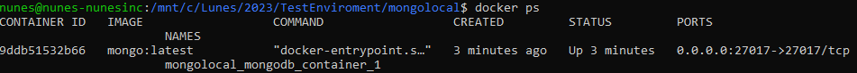
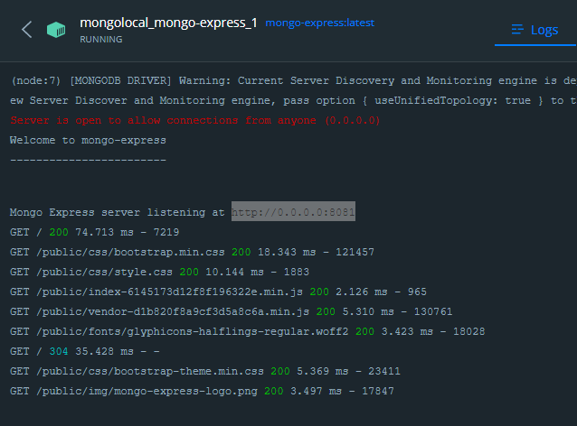

## DEV MODE
Run MONGODB on LOCALHOST for development using Docker
## Running the Docker containers
* Tested on  WSL Windows shell

```bash
sudo  docker-compose up -d

```

## How to check MongoDB container is running or not?

```bash
docker ps

```

* Result: 



## To check our data container, check with command below.

```bash
docker volume ls

```


## MONGODB EXPRESS

Open Brower

```bash
 http://localhost:8081/

```

* Status on Docker Desktop: 




## Conect a MONGOSHELL

```bash
 docker exec -it mongolocal_mongodb_container_1 mongosh

```